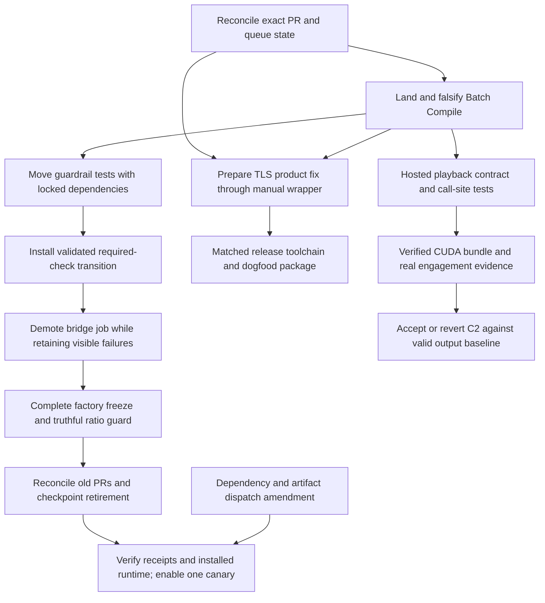

# Executing the September 7 audit

Read [the findings](project-20260907.md), then select one packet from
[packets-20260907.json](packets-20260907.json). This is an implementation proposal
for adoption by the current hub. It is not a second live queue or an activation
receipt. Existing user authority and installed gates continue to apply.

The JSON contains 33 separately selectable packets, including all 15 existing
product/playback cards. A worker reads **one packet**, not the entire file. From
this checkout, extract the first packet and its shared contract without a model:

```powershell
$auditPlan = Get-Content docs/audits/packets-20260907.json -Raw | ConvertFrom-Json
$auditPlan.worker_contract | ConvertTo-Json -Depth 10
$auditPlan.packets | Where-Object id -eq 'AUD-RECONCILE' | ConvertTo-Json -Depth 10
```

Handoff instruction: “Use the current hub; do not create another one. Re-derive
`AUD-RECONCILE` against live state, record the actual next eligible packet, and
execute that one bounded work block under the existing authority. Preserve the
commit, evidence and terminal disposition. Escalate only the named failed
precondition, then continue independent ready work.” A packet marked
`requires_policy_adoption` cannot itself grant its proposed new authority.

## The first executable work block

The current hub should reconcile PR #82 at its exact current head, retrieve every
required check and its own existing reviews, and finish the existing step 0.4a-i.
At this audit's first GitHub read, the Batch Compile job was successful and Windows
Product Oracles was still running. Do not redispatch its implementation just
because its former process exited. Review and merge remain distinct from check
success. Write the step's `0.4a-workflow-base.json` only after the actual merge.

In the same bounded reconciliation, record #80's merge and inspect #64/#67 against
their stale queue cards. Do not restart their authors. Preserve an unresolved
acceptance subtask if the merged implementation does not satisfy all evidence.

The first product implementation should be `PROD-TLS-VERIFY-1`, using its existing
card and editing wrapper. The recovery plan explicitly permits individual product
lanes before the unattended loop is enabled (line 530). Prepare its deterministic
download tests now; merge only after applicable review and product gates pass.
This work needs no CUDA host. TLS and GUI compile work must use separate worktrees;
the coordinator serializes merges that touch the same files.

## Dependency order



The deployed recovery's full Phase 0 order is preserved. New findings F03/F04
require bounded amendments through its existing review process; they do not
justify silently editing its ratified manifest or enabling an unqualified loop.

| Wave | Work | Evidence that ends the wave | Suggested elapsed target, not a promise |
|---|---|---|---|
| **0: Recover current state** | Reconcile #80/#82/#64/#67, live protection, installed task, receipts and active owner. | One exact next step, all old work accounted for, no duplicate hub. | First work block |
| **1: Deliver one safe product change** | TLS fix plus required full-app compile; finish the existing Phase 0 chain and dependency amendment. | First product PR merged and verified; first editing canary has a terminal result. | 2–4 working days, subject to hosted checks |
| **2: Prove user-visible quality** | Waiter, flags and Dual ISO seam; counter contracts; matching Windows package; real clip smoke. | Named candidate executable hash, output and lifecycle checks; GPU capability separately reported. | Next 3–5 working days |
| **3: Resolve performance and structural debt** | C2 provenance/engagement; CDNG seam; bounded upstream reconciliation; header split; index/evidence hygiene. | Accepted or safely reverted C2; output-equivalent export; individually reviewed integrations. | Following 1–2 weeks, GPU leg conditional |
| **4: Reduce operating cost** | Compact startup, qualified Haiku/Luna adapter, measured spend and retry behavior. | Ten bounded pilot tasks with terminal receipts; no lost work; lower tokens per accepted result. | Start measurement immediately; expand only on evidence |

## Small-model operating contract

Use deterministic code for sorting, dependency checks, claims, receipt validation,
retry accounting and state reconciliation. Use a model for the bounded patch or
evidence judgment. A model should not reconstruct the operating system from
months of chat on each turn.

**One packet, one writer, one worktree, one review subject.** The coordinator
supplies an exact base SHA, current task/card revision, allowed paths, test
commands, input artifact hashes and expected result. The worker reads the scoped
source and mandatory instructions, changes only those paths, runs the named
checks, reviews the diff and commits the owned change. A wider write scope requires
a new packet; it is not a reason to improvise or edit the worker's own guard.

Recommended packet context: at most about 12 KB of task-specific instructions,
plus the mandatory repository policies and relevant source/test excerpts. This is
a proposed optimization budget, not a license to omit a binding instruction.
Return at most about 2 KB of summary; preserve detailed command output in artifacts.
Large files are read by symbol and callers, not copied into every prompt.

Current execution and the qualified target are different:

| Work | Available safe route now | Target after a reviewed adapter change |
|---|---|---|
| Snapshot, classify, compare hashes, summarize a fixed failure | Luna read-only; deterministic scripts first | Luna low reasoning or Haiku on a compact structured packet |
| Small edits and associated tests | Sonnet editing wrapper with explicit tools | Sonnet; Haiku only for the task classes it passes in qualification |
| CUDA concurrency, golden/output questions, authority changes | Experienced implementer and current independent review gates | Same escalation class; a cheap worker may gather evidence first |
| PR acceptance | Current exact-head Sol review plus required checks | Preserve until a separate review-policy change is proved |
| Luna editing | Refused by current adapter, wrapper and dispatcher | Only after equivalent isolation and containment are installed and negatively tested |

The adapter currently hard-codes Luna **high** reasoning and has no Haiku lane.
Do not claim a cost reduction before the launched receipt proves the effective
model and reasoning setting. Sonnet's CLI alias is also not a fixed version:
record the resolved model returned by the run. Qualify against the installed CLI,
not a remembered API model name.

OpenAI describes Luna as suited to focused coding and background automation, but
usage also depends on context, reasoning and tool use
([official documentation](https://learn.chatgpt.com/docs/pricing)). The assignment
above is a local engineering proposal, not a model performance guarantee. Claude
model/alias behavior should be checked against the
[official configuration documentation](https://code.claude.com/docs/en/model-config).

## Preflight and acceptance must exist outside prose

Before reserving a model invocation, the dispatcher must:

1. Resolve the product/factory kind, live owner and selected card revision.
2. Reject a completed, claimed, frozen, superseded or unsupported task.
3. Validate every dependency by exact PR state or artifact identity. Export the
   C2 `dependencies.json` with a named writer and schema. A missing artifact is
   `BLOCKED_CAPABILITY` or `BLOCKED_DEPENDENCY`, not permission to investigate it
   inside an expensive implementation attempt.
4. Verify procedure hash, allowed paths, base commit and tool capability. Source
   freshness and deployed executable/DLL freshness are different checks.
5. Preflight disk at the standing **20 GiB floor** using projected output, tests,
   credential availability without secret output, and the assigned venue.
6. Establish a durable claim and attempt id before launch; retrying the same
   delivery event must not create a second branch, charge or worker.

Acceptance is a conjunction: valid output artifact, owned diff, applicable tests,
independent review of the current head, merge, and relevant target verification.
Exit code zero alone is never proof. #80's provider-refusal distinction must be
preserved by every downstream consumer. Missing/unknown is not zero/pass.

For app changes, use the established build and test workflows, including the
Windows Qt wrappers and self-contained MinGW runtime. On a GUI-affecting change,
the user-facing `platform/qt/build-release/release/MLVApp.exe` must be rebuilt and
its path, time, size and SHA-256 reported. Documentation-only blocks do not need
an app build.

For playback, use the existing advancing-frame, skipped-frame and output rules.
Distinguish realtime/drop-frame preview from full-frame export. Do not translate
“present every expected source frame” into a universal preview rule without
checking the intentional drop-frame mode. A fake backend proves validator logic;
it cannot certify CUDA engagement. GPU parity with a synchronous path does not
replace the independently known-good output baseline.

For output-preserving extraction/refactoring, keep the existing real-clip A/B and
golden requirements. Never re-bless a failed comparison to get a green result.
Missing hardware blocks that capability's acceptance leg, not TLS, docs, hosted
counter logic or other independent product work.

## Retry, escalation and work-in-progress

Adopt these limits through the existing policy amendment process:

- Retain the plan's maximum four model attempts: initial Sonnet, one corrected
  attempt with the failure attached, one senior repair/adjudication, then a
  terminal disposition. Do not start a fifth differently named card for the same
  failed tuple. Record provider refusals separately from implementation failures.
- An identical input/head/test failure is not retried until a named input changes.
  Infrastructure checks may be reattempted only with a recorded external-state
  change or bounded infrastructure recovery. No repeated re-runs-to-green.
- Reviewers submit one consolidated blocker batch for a fixed head. After a patch,
  reassess changed behavior and affected checks. New concrete defects still count;
  repeated wording changes or score debates do not reset the attempt budget.
- One hub; initially one active editing lane and one review lane. A second editing
  lane is allowed only for disjoint files and independent capabilities. The shared
  `console_tests.pro`, workflow tests and MainWindow are serial merge hotspots.
- Factory work requires a product blocker id and a measurable unblock result.
  Phase 0 is the temporary exception already authorized by the recovery. After it,
  retain the existing cap of one justified factory item per week.
- An exhausted task records owner, exact failure, preserved branch/artifacts,
  recovery command and the event that permits another attempt. The coordinator
  immediately selects unrelated ready work. A timed wait belongs to the scheduler,
  not a spinning chat.

## A workable completion contract to ratify

Use three separately reported states: **change accepted**, **work block committed
and accounted for**, and **global repository maintenance current**. Do not describe
a dirty or unknown repository as clean. Equally, do not force a TLS delivery to
resolve every historical branch merely to report that its PR passed.

The amendment must explicitly reconcile `AGENTS.md`, `CLAUDE.md`, their closeout
children, `closeout.config.json`, the CLI's completion logic and the newer PR plan.
It must retain exact owned-file protection, required product checks, independent
review, golden authority and evidence-preserving deletion. Test it on a disposable
repo with an unrelated dirty sibling: the sibling stays byte-identical, product
status is accurate, global cleanup remains visibly retained. This is a small
contract migration, not authority to disable all closeout checks.

## Weekly proof that the churn has stopped

Use one derived digest; no parallel maturity scorecard.

| Measure | Definition / proposed success criterion |
|---|---|
| Accepted product output | Count merged product PRs with applicable target checks and named acceptance evidence; link the user-facing result. |
| Product source share | Mainline-only non-merge commits touching `src/` or `platform/`; report mixed commits separately. Existing target: at least 50% for three weeks. It is a proxy, not the objective. |
| Cost per accepted result | Sum actual tokens/cost over implementation, review and retries divided by accepted tasks. Null stays unknown. Keep provider refusal and cached/input/output usage separate. |
| Dispatch efficiency | Existing target at most four dispatches per accepted product PR; explicitly account for read-only and refused attempts. |
| Cycle time and blockers | Queue-ready to accepted, plus age and named release event for each blocked capability. |
| Release quality | Named candidate build; zero new blocking golden/output failures; real advancing playback and successful export/reopen. |
| Recovery | Replay one completion/reconciliation event and simulate one interrupted task; no duplicate charge/dispatch and no lost owned work. |

After the first two working days, there should be a product result or an exact
remaining gate with evidence. If the only output is another factory plan revision,
stop expanding the plan and adjudicate that blocker once. Longer-term GPU or
cross-platform claims wait for their own evidence; they must not erase progress
on independent work streams.
