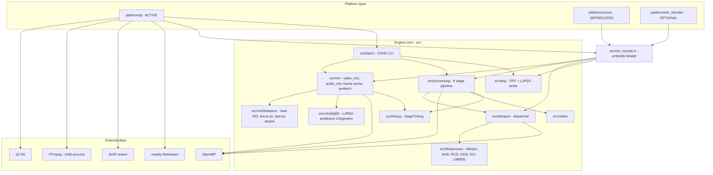

# MLV App — Module Architecture

Cross-links: [00 Overview](../00-overview.md) | [01 Src Architecture](../../.claude-state/docs-audit/01-src-architecture.md) | [02 Platform UI](../../.claude-state/docs-audit/02-platform-ui.md) | [03 Build & CI](../../.claude-state/docs-audit/03-build-and-ci.md) | [04 Tests & Fixtures](../../.claude-state/docs-audit/04-tests-and-fixtures.md)

## How to read this

The diagram shows the dependency direction between MLV App's internal modules and its external toolchain. Arrows point from a consumer to the module it depends on. The top band is the platform layer (Qt GUI + deprecated Cocoa front-end). The middle band is the engine core rooted at `src/` and exposed through the umbrella header `src/mlv_include.h`. External libraries hang off the side: Qt drives the UI, FFmpeg is invoked as a child process for encoding, OpenMP parallelises the hot loops, AVIR does preview downscaling, and maddy renders in-app Markdown documentation.

## ASCII

```
External deps                          Platform layer (platform/)
+-------------------+          +------------------------------------------+
| Qt 5/6 widgets    |<---------| platform/qt/             (ACTIVE)        |
| multimedia/opengl |          |   MainWindow, RenderFrameThread,         |
+-------------------+          |   SessionModel, Scopes, Batch dialogs    |
| FFmpeg (child)    |<---------|                                          |
+-------------------+          +-------+------------+----------+----------+
| AVIR (resizer)    |<-----------------+            |          |
+-------------------+                               |          |
| maddy (markdown)  |<-----------------+            |          |
+-------------------+                  |            |          |
                                       |   platform/cocoa/ (DEPRECATED)
                                       |   mlv_blender/    (OPTIONAL)
                                       v            v          v
 Umbrella header:   +--------------------------------------------------+
 src/mlv_include.h  |  Engine core (src/)                              |
                    +-----+--------------+-------------+---------------+
                          |              |             |
                          v              v             v
                  +--------------+ +-------------+ +----------+
                  |  src/mlv     | | src/       | | src/dng  |
                  |  video_mlv   | | processing | |  DNG TIFF|
                  |  audio_mlv   | | raw_proc + | |  writer  |
                  |  frame_cache | | 9 stages   | |  + LJPEG |
                  |  prefetch    | | + denoiser | +----+-----+
                  +---+------+---+ | + rbfilter |      |
                      |      |     | + CA filter|      |
                      |      |     +------+-----+      |
        +-------------+      |            |            |
        v                    v            |            |
+----------------+ +------------------+   |            |
| src/mlv/       | | src/mlv/         |   |            |
| llrawproc      | | liblj92          |   |            |
| (dual ISO,     | | (LJPEG codec)    |   |            |
|  focus px,     | +------------------+   |            |
|  bad px,       |                        |            |
|  stripes,      |                        |            |
|  dark frame)   |                        |            |
+----------------+                        |            |
                                          v            |
                                    +-----------+      |
                                    | src/      |      |
                                    | debayer   |      |
                                    | (9 algos) |      |
                                    +-----+-----+      |
                                          |            |
                                          v            |
                                    +------------------+
                                    | src/librtprocess |
                                    | (AMaZe/AHD/RCD/  |
                                    |  DCB/IGV/LMMSE)  |
                                    +------------------+

 Also used by platform/qt:           OpenMP (#pragma omp) ----- parallelises
 +-------------+  +-------------+    debayer strips, curves, blur,
 | src/batch   |  | src/matrix  |    denoise across the whole core.
 | CDNG CLI    |  | src/debug   |
 | BatchRunner |  | (StageTime) |
 +-------------+  +-------------+
```

## Mermaid



## Notes

- `platform/cocoa/` is kept in-tree but tagged "very very deprecated" in `README.md`.
- `src/mlv/mcraw/` and `src/mlv/camid/` are peers of `llrawproc` under `src/mlv/`; omitted from the top-level view for readability.
- Vendored libraries (`librtprocess`, `liblj92`, `rbfilter`, `tinyexpr`, `genann`, `AVIR`, `maddy`) live in-tree — no external package required.
