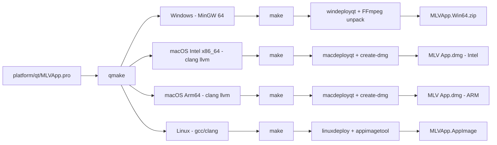
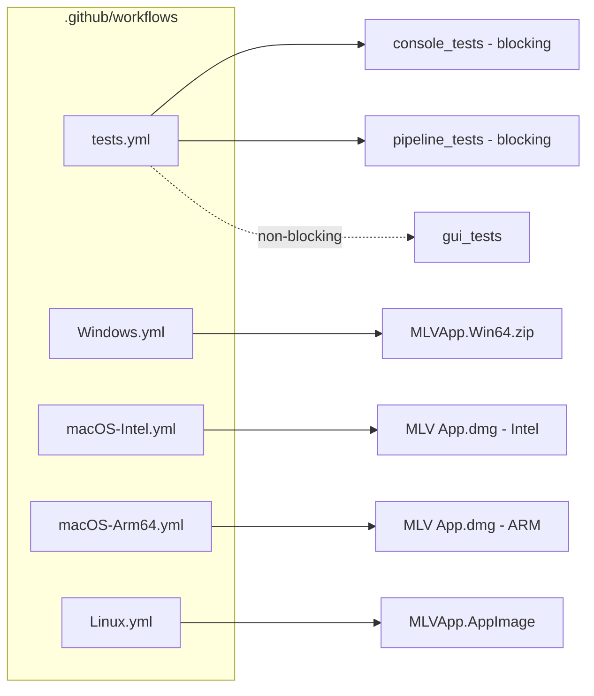

# MLV App — Build & CI

Cross-links: [00 Overview](../00-overview.md) | [01 Src Architecture](../../.claude-state/docs-audit/01-src-architecture.md) | [02 Platform UI](../../.claude-state/docs-audit/02-platform-ui.md) | [03 Build & CI](../../.claude-state/docs-audit/03-build-and-ci.md) | [04 Tests & Fixtures](../../.claude-state/docs-audit/04-tests-and-fixtures.md)

## How to read this

Two sub-diagrams below. Part (a) traces the per-platform build flow from `MLVApp.pro` through `qmake` and `make` to the platform-specific deployer (`windeployqt`, `macdeployqt`, `linuxdeploy`). Part (b) lists the five GitHub Actions workflows and the release artifact each produces. Legend at the bottom.

## (a) Build flow per platform

### ASCII

```
 +-------------------------+
 | platform/qt/MLVApp.pro  |   single .pro file, per-platform scopes
 | (DEFINES, SOURCES,      |
 |  FFmpeg/raw2mlv links)  |
 +------------+------------+
              |
      qmake (reads scopes)
              |
 +------------+------------+------------------+------------------+
 |            |            |                  |                  |
 v            v            v                  v                  v
Windows     macOS         macOS              Linux             Tests
MinGW 64    Intel x86_64  Arm64              x86_64            (qmake -r
-mssse3     clang llvm    clang llvm         gcc / clang        tests.pro)
+ ompgomp   -lomp         -lomp + libunwind  -msse4.1 -lgomp
              |            |                  |                  |
           make          make               make               make
              |            |                  |                  |
           .app in      .app in             .app in            ./MLVApp
           build/       build/              build/             binary
              |            |                  |                  |
         macdeployqt   macdeployqt         linuxdeploy         (unit + golden
         + create-dmg  + create-dmg         + appimagetool      binaries)
              |            |                  |                  |
     MLVApp.Win64.zip  MLV App.dmg       MLV App.dmg        MLVApp.AppImage
     via windeployqt    (Intel)           (ARM64)
              |
     FFmpeg + raw2mlv
     unzipped into bin
```

### Mermaid



## (b) CI workflow map

### ASCII

```
 +----------------------+              Artifacts
 | tests.yml            |----> console_tests.exe   (blocking)
 | (Windows test CI)    |----> pipeline_tests.exe  (blocking)
 | windows-latest,      |----> gui_tests.exe       (non-blocking,
 | Qt 6.10.2 aqt)       |                          continue-on-error)
 +----------------------+

 +----------------------+
 | Windows.yml          |----> MLVApp.Win64.zip     (release)
 | windows-latest, choco|       includes windeployqt + FFmpeg + raw2mlv
 +----------------------+

 +----------------------+
 | macOS-Intel.yml      |----> MLV App.dmg          (Intel release)
 | macos-13, brew llvm  |       via macdeployqt + create-dmg
 +----------------------+

 +----------------------+
 | macOS-Arm64.yml      |----> MLV App.dmg          (ARM64 release)
 | macos-14, brew llvm  |       via macdeployqt + create-dmg
 +----------------------+

 +----------------------+
 | Linux.yml            |----> MLVApp.AppImage      (release)
 | ubuntu-22.04, apt    |       via linuxdeploy + appimagetool
 +----------------------+
```

### Mermaid



## Legend

- Solid arrow: required output of the job (build failure if missing).
- Dashed arrow: non-blocking job; CI tolerates a red result.
- `aqt` = `aqtinstall` (Qt installer used in `tests.yml`).
- `choco` = Chocolatey package manager (Windows release workflow).
- Deployers: `windeployqt` copies Qt DLLs + FFmpeg/raw2mlv zips; `macdeployqt` rewrites dylib paths and embeds frameworks; `linuxdeploy` plus `appimagetool` produces a self-contained AppImage.

## Notes

- Version `1.15.0.0` is baked into `platform/qt/MLVApp.pro` (lines 450-460) and the git SHA is captured at build time into `MLVAPP_GIT_SHA` (fallback `unknown`).
- AVX2 fast path is opt-in via `CONFIG+=mlvapp_enable_avx2` or `MLVAPP_ENABLE_AVX=1` — see `platform/qt/avx_optin.pri`.
- Perf tests (`tests/perf/`) run locally only; they are intentionally excluded from CI due to VM noise.
- Fuzz targets (`tests/fuzz/`) are opt-in and not wired into any workflow.
