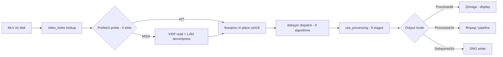
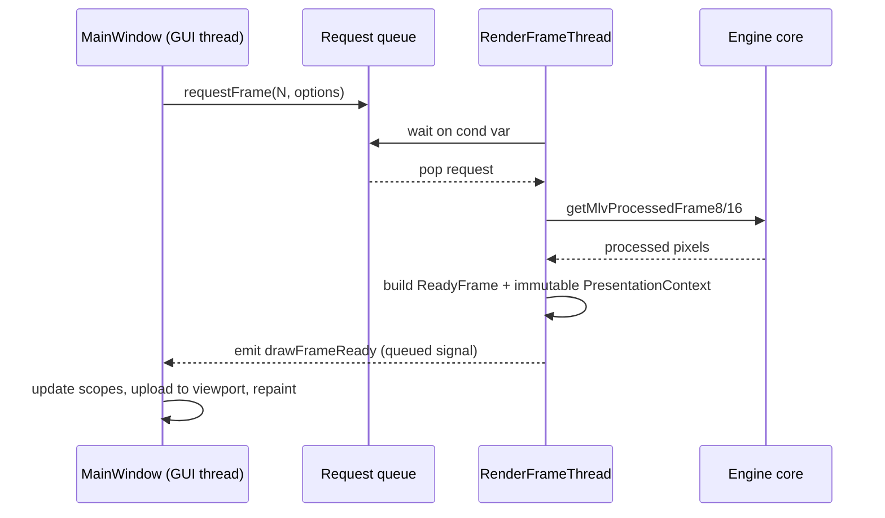

# MLV App — Frame Pipeline (disk to RGB)

Cross-links: [00 Overview](../00-overview.md) | [01 Src Architecture](../../.claude-state/docs-audit/01-src-architecture.md) | [02 Platform UI](../../.claude-state/docs-audit/02-platform-ui.md) | [03 Build & CI](../../.claude-state/docs-audit/03-build-and-ci.md) | [04 Tests & Fixtures](../../.claude-state/docs-audit/04-tests-and-fixtures.md)

## How to read this

The main diagram tracks one frame from the MLV file on disk to a displayable RGB surface. Every stage mutates `uint16` Bayer in place until debayer dispatch, then downstream stages work on RGB planar. The sub-diagram at the bottom shows the Qt-side handoff: `RenderFrameThread` builds a `ReadyFrame`, queues it, and hands over an immutable `PresentationContext` to `MainWindow::drawFrameReady` on the GUI thread.

## Main pipeline (ASCII)

```
 +--------+     +--------------+     +----------------------+     +-------------------+
 | MLV on |     | video_index  |     | Prefetch probe       |     | VIDF read +       |
 | disk   |---> | lookup:      |---> | 4 slots              |---> | LJ92 decompress   |
 | (.mlv) |     | frame_index_t|     | HIT -> raw_uint16    |     | pred 1 / 6 /      |
 +--------+     +--------------+     | MISS -> read block   |     | generic           |
                                     +-----+----------------+     +---------+---------+
                                           | HIT                            |
                                           +----+---------------+-----------+
                                                v               v
                                   +---------------------------------------+
                                   | llrawproc.c (in-place uint16)         |
                                   |   1. Dark frame subtraction           |
                                   |   2. Focus pixel remap                |
                                   |   3. Bad pixel remap (user + auto)    |
                                   |   4. Vertical stripe correction       |
                                   |   5. Dual ISO (20-bit full / preview) |
                                   |   6. Pattern noise removal            |
                                   |   7. Chroma smooth (2x2/3x3/5x5)      |
                                   +------------------+--------------------+
                                                      v
                                   +---------------------------------------+
                                   | debayer.c dispatcher                  |
                                   |   None | Basic | Bilinear | AMaZe    |
                                   |   AHD  | DCB   | RCD | IGV | LMMSE   |
                                   |   (vertical strips, one worker each)  |
                                   +------------------+--------------------+
                                                      v
                                   +---------------------------------------+
                                   | raw_processing.c - 9 stages           |
                                   |  S1 Setup (rebuild 65536 LUTs)        |
                                   |  S2 Shadows/Highlights prep (blur)    |
                                   |  S3 Highest-green hi-light recovery   |
                                   |  S4 Core: Levels -> WB/Color matrix   |
                                   |           -> Creative -> Output mat   |
                                   |  S5 Denoise (2D median)               |
                                   |  S6 RBF edge-aware / clarity / sharp  |
                                   |  S7 Chromatic aberration correction   |
                                   |  S8 Gamma / tonemap / transfer / gamut|
                                   |  S9 Optional direct 8-bit (AVX2)      |
                                   +------------------+--------------------+
                                                      v
                              +------------------------------------------+
                              |                Output routing            |
                              +-----+-------------+----------------+-----+
                                    v             v                v
                           +-------------+ +-------------+ +-------------+
                           | Processed8  | | Processed16 | | DNG writer  |
                           | -> QImage   | | -> ffmpeg / | | saveDngFrame|
                           | -> display  | | pipeline    | | -> .dng seq |
                           +-------------+ +-------------+ +-------------+
```

## Main pipeline (Mermaid)



## RenderFrameThread handoff sub-diagram

The presentation handoff guarantees the GUI thread reads a consistent snapshot. `RenderFrameThread` allocates a `ReadyFrame`, does all decode/debayer/processing, then packages an immutable `PresentationContext` alongside and emits `drawFrameReady`. `MainWindow` only reads from that context — no back-reference into the worker.

### ASCII

```
   RenderFrameThread (worker)                    MainWindow (GUI thread)
   +-----------------------------+               +----------------------------+
   | 1. Pop request off queue    |               |                            |
   | 2. Wait on queue cond var   |<---- queue ---| requestFrame(N, options)   |
   | 3. getMlvProcessedFrame8/16 |               |                            |
   | 4. Debayer + processing     |               |                            |
   | 5. Build ReadyFrame         |               |                            |
   | 6. Build PresentationContext|               |                            |
   |    (immutable snapshot)     |               |                            |
   | 7. emit drawFrameReady(rf)  |--- signal --->| drawFrameReady(ReadyFrame) |
   +-----------------------------+   (queued)    | 8. Update scopes           |
                                                 | 9. Upload to viewport      |
                                                 |10. Post repaint            |
                                                 +----------------------------+
```

### Mermaid



## Notes

- Prefetch telemetry: `raw_uint16_prefetch_hit`, `raw_uint16_prefetch_decode_failures`. Disable with `MLVAPP_DISABLE_RAW_UINT16_PREFETCH=1` to restore thread-local decode telemetry.
- Stage 9 (direct 8-bit fast path) is gated by `MLVAPP_ENABLE_AVX2=1` at `qmake` time plus runtime dispatch via `processingFastPathAvx2Active`.
- Dual ISO fixtures exercise LJ92 predictor 1, not pred6 — optimise the generic path.
