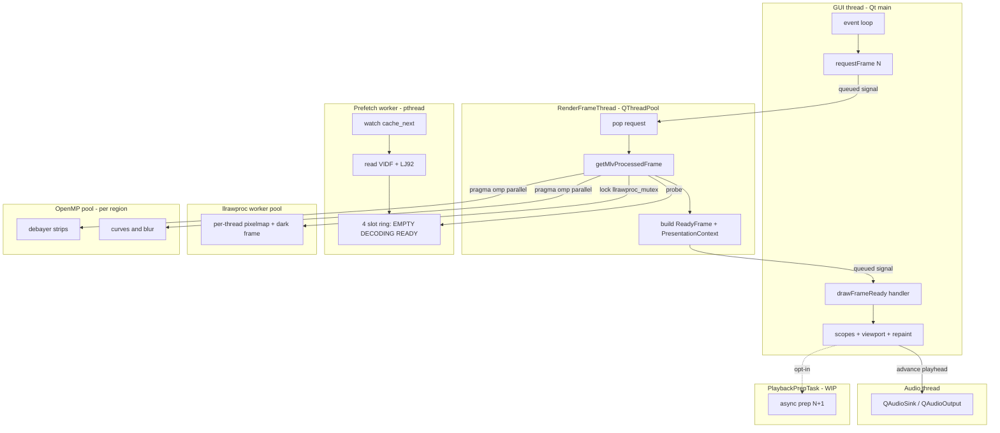
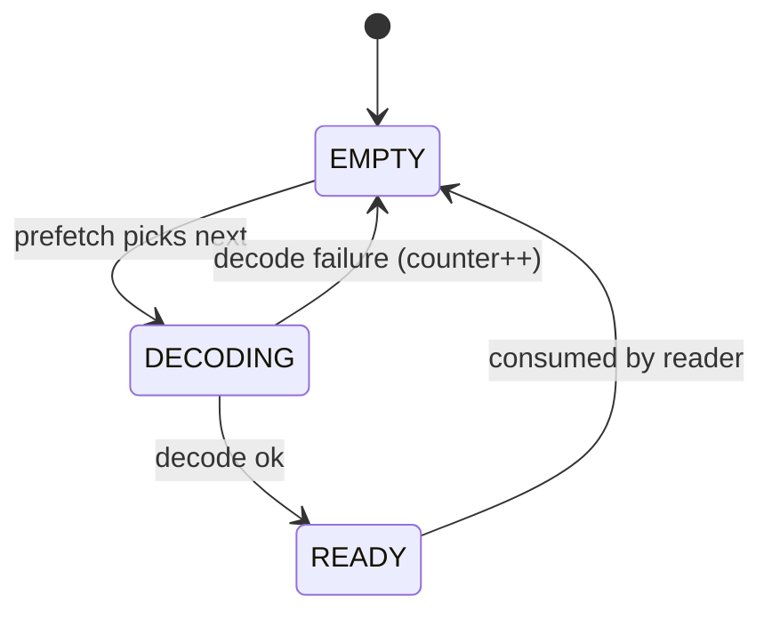

# MLV App — Threading Model

Cross-links: [00 Overview](../00-overview.md) | [01 Src Architecture](../../.claude-state/docs-audit/01-src-architecture.md) | [02 Platform UI](../../.claude-state/docs-audit/02-platform-ui.md) | [03 Build & CI](../../.claude-state/docs-audit/03-build-and-ci.md) | [04 Tests & Fixtures](../../.claude-state/docs-audit/04-tests-and-fixtures.md)

## How to read this

Each column is a distinct thread or thread pool. Time flows top to bottom. Horizontal arrows cross between columns via a Qt queued signal, a mutex wake, or a condition-variable hand-off. The GUI thread never blocks on decode; it only consumes completed `ReadyFrame` structures. The prefetch worker pre-populates up to 4 decoded slots ahead of the GUI request. OpenMP pools are implicit — they are spun up and torn down per parallel region inside the debayer and processing stages.

## Swimlane (ASCII)

```
 GUI thread           RenderFrameThread    Prefetch worker    llrawproc pool   OpenMP pool        Audio thread       PlaybackPrepTask
 (Qt main)            (QThreadPool)        (pthread)          (pthread pool)   (per-region)       (QAudioSink/Out)   (WIP, opt-in)
 =========            =================    ===============    ==============   ============       ================   ================
 event loop           wait(queue cond)     watch cache_next   idle             -                  stream callbacks   idle
    |                       |                    |              |                                      |                   |
 requestFrame(N)----signal->pop request           |              |                                      |                   |
    |                       |                    |              |                                      |                   |
    |                       v                    |              |                                      |                   |
    |                  frame_index lookup        |              |                                      |                   |
    |                       |                    |              |                                      |                   |
    |                  probe slot----------> check slots         |                                      |                   |
    |                       |                [EMPTY->DECODING]   |                                      |                   |
    |                  HIT? yes/no           read VIDF + LJ92    |                                      |                   |
    |                       |                    |              |                                      |                   |
    |                  apply llrawproc --- lock llrawproc_mutex->work (per thread pixelmap)             |                   |
    |                       |                    |              |                                      |                   |
    |                  debayer dispatch -------------------------|-----> omp parallel (strips)          |                   |
    |                       |                    |              |              |                       |                   |
    |                  processing (9 stg) --------------------------------------+-> omp parallel (LUT/blur) |               |
    |                       |                    |              |                                      |                   |
    |                       |                    v              |                                      |                   |
    |                       |              slot=READY           |                                      |                   |
    |                       |                    |              |                                      |                   |
    |                  build ReadyFrame + PresentationContext   |                                      |                   |
    |                       |                    |              |                                      |                   |
    |<--emit drawFrameReady-+                    |              |                                      |                   |
 update scopes                                   |              |                                      |                   |
 upload to viewport                              |              |                                      | audio cursor sync |
 repaint                                         |              |                                      | (frame -> samples)|
    |                                            |              |                                      |                   |
 advance playhead ----------------------------------------------------------------------------------------------------> prep N+1 (opt-in)

 Mutexes / CVs:                                                  Notes:
  - main_file_mutex[N]  per .mlv file                             - OpenMP spins up and tears down per #pragma region
  - g_mutexFind         video_index lookups                       - Audio thread owns QAudioSink/QAudioOutput buffer fills
  - g_mutexCount        cache size tracking                       - PlaybackPrepTask is an experimental async prep worker;
  - llrawproc_mutex     init/free                                    still WIP, default off.
  - llrawproc_worker_mutex  pool state
  - prefetch slot cond var   EMPTY <-> DECODING <-> READY
```

## Swimlane (Mermaid)



## Prefetch slot lifecycle

### ASCII

```
              +---------+
              |  EMPTY  |
              +----+----+
                   | prefetch worker picks next frame
                   v
              +-----------+
              | DECODING  |
              +-----+-----+
                    | read VIDF + LJ92 decompress succeeded
                    v
              +---------+
              |  READY  |
              +----+----+
                   | GUI / RenderFrameThread consumed frame
                   v
              +---------+
              |  EMPTY  |  (loops back)
              +---------+
```

### Mermaid state diagram



## Notes

- `MLV_RAW_UINT16_PREFETCH_SLOTS = 4` (see `src/mlv/video_mlv.c`).
- Thread-local telemetry (`MLV_STAGE_THREAD_LOCAL`, `MLV_PROCESSING_THREAD_LOCAL`) is hidden when the prefetch worker is on; gate with `MLVAPP_DISABLE_RAW_UINT16_PREFETCH=1` when profiling.
- The audio thread is a QIODevice callback surface; it does not read MLV frames directly — it only syncs its cursor to the playhead set by the GUI thread.
